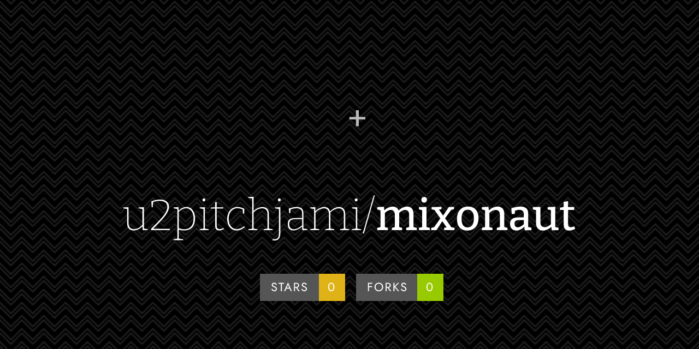

# 🎶 Mixonaut

## 🚀 Objectif
Mixonaut est un projet Python (>3.1) de gestion **augmentée** d'une bibliothèque musicale.  
Il combine [Beets](https://beets.io/) et [Essentia](https://essentia.upf.edu/) pour offrir une **analyse audio avancée** et un **matching intelligent** de pistes, dans une optique de DJing.  
L'objectif est de recréer une alternative moderne à Rapid Evolution 3, logiciel historique mais obsolète.

---

## 🧰 Stack technique
- **Python 3.11+**
- **Beets** (image Docker custom avec plugins adaptés)
- **Essentia** (compilé dans une image Docker custom, avec dépendances spécifiques)
- **SQLite** (base Beets enrichie de tables supplémentaires)
- **CronBoss** (planification et automatisation des scripts)
- **qBittorrent API** (intégration import/suppression torrents)
- **Metaflac** et **eyed3** (gestion des tags FLAC/MP3)

---

## ⚙️ Fonctionnalités principales

### 🔄 Import automatique
- Surveillance d’un dossier d’entrée  
- Extraction automatique (`.zip`, `.rar`, `.7z`, `.cue`, `.iso`)  
- Conversion **WAV → FLAC**  
- Déplacement automatique des fichiers vers le dossier d’import Beets  
- Interaction avec **qBittorrent** : suppression auto des torrents selon règles (ratio, délai)  
- Gestion des échecs → fichiers non importés restent en attente + ajout dans un fichier `beets manual import`  

### 🎼 Analyse audio avancée (Essentia + custom)
- **Hash/fingerprint audio**
- **Analyse Essentia complète** (50+ features)
- Parsing JSON Essentia et stockage des données utiles
- Calcul de données dérivées :  
  - Beat intensity (algo custom)  
  - Mood (recréé en local car API obsolète)  
  - Genre (basé sur embeddings Essentia, plus fiable que plugins Beets)  
  - ReplayGain (contournement des échecs Beets)

### 🎹 Transposition & Matching DJ
- Conversion des keys en **Camelot Wheel**
- Matching basé sur pondération configurable :  
  - Key (Camelot)  
  - Genre (embedding similitude)  
  - Beat intensity  
  - BPM  
  - Mood  
  - Durée  
- Support des transpositions automatiques → compatibilités dynamiques (dominant, subdominant, scale change, diagonal, jaws…)  
- Export des résultats en **Markdown**

### 🗂️ Administration & scripts automatisés
- **mbsync** → synchronisation avec MusicBrainz  
- **Recap** → exports MD des ajouts/modifs/suppressions  
- Détection de **doublons potentiels**  
- Nettoyage des **dossiers vides**  
- Vérification de l’intégrité audio  
- Vérification des IDs MusicBrainz par album  
- Dashboard statistiques (extractions de la DB)  
- Vérification de cohérence entre DB Beets et tags fichiers

### 🛠️ Base de données enrichie
Ajout de 7 tables custom (exemples) :  
- `audio_features` → données Essentia  
- `track_transposition` → compatibilités calculées  
- `audio_hash` → empreintes audio  
- …

---

## 🏗️ Architecture
```
Fichiers musicaux → Dossier Entrée → Import Beets
       │                     │
       ▼                     ▼
   Extraction/Conversion     DB SQLite (Beets + custom)
       │                     │
       ▼                     ▼
   Essentia (analyse) → Audio features + matching
       │
       ▼
Retro-alimentation tags (FLAC/MP3)
       │
       ▼
Résultats / Exports Markdown
```

---

## 📦 Roadmap & améliorations
- 🎚️ Interface plus ergonomique pour le matching DJ  
- 📂 Migration éventuelle SQLite → base plus robuste (taille croissante)  
- 🎧 Connexion avec un lecteur (ex : **Mopidy**)  
- 🎵 Rétro-alimentation des écoutes via **ListenBrainz** (plus fiable que Last.fm)  
- 🌐 Intégration future possible avec Rekordbox / Traktor / Serato  
- 🎶 Génération automatique de playlists intelligentes  

---

## 👤 Auteur
👤 **u2pitchjami**  

[](https://bsky.app/profile/u2pitchjami.bsky.social)  
[](https://twitter.com/u2pitchjami)  
  
  

- Twitter: [@u2pitchjami](https://twitter.com/u2pitchjami)  
- Github: [@u2pitchjami](https://github.com/u2pitchjami)  
- LinkedIn: [Thierry Beugnet](https://linkedin.com/in/thierry-beugnet-a7761672)  

---